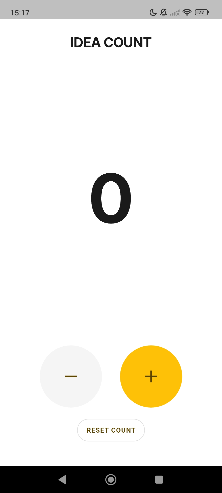
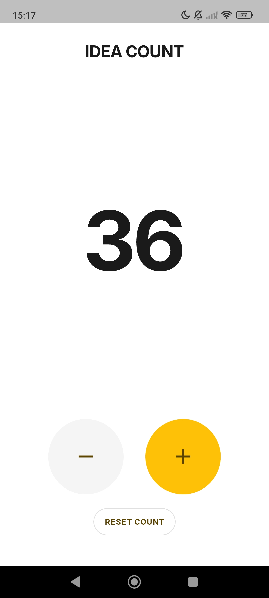
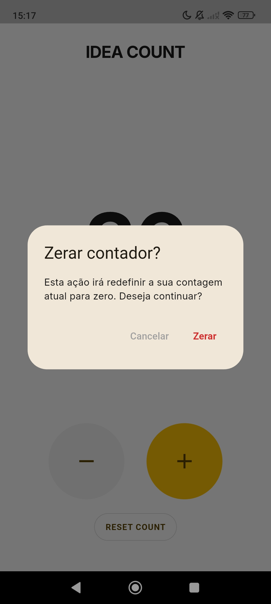

# Idea Count - Contador Simples

## Definição do produto

- **Nome**: Idea Count
- **Objetivo**: Um contador digital simples, rápido e minimalista para aumentar ou diminuir um valor com apenas um toque.
- **Problema que resolve**: Permite realizar contagens rápidas sem distrações, substituindo métodos improvisados como contar mentalmente, usar papel ou aplicativos cheios de recursos desnecessários.
- **Público**: Usuários que precisam contar coisas rapidamente: repetições de exercícios; itens; pontuações; tarefas; qualquer contagem simples do dia a dia.
- **Plataformas**: Android.
- **Funcionalidades V1 (somente o essencial)**:
    - Exibir um número centralizado na tela.
    - Valor inicial: **0**.
    - Botão **+** para incrementar.
    - Botão **-** para decrementar.
    - Atualização instantânea do valor.
    - Efeito de Impulso / Escala no Número (Scale Animation).
    - Vibração ao toque.
    - Salvar último valor.
    - Botão resetar.
    - Animação de Salto ao Resetar (Reset Jump).
    - Diálogo de Confirmação no Reset.
    - Interface minimalista.
- **Possíveis funcionalidades futuras (não entra na V1)**:
    - Sons.
    - Modo escuro.
    - Histórico de contagens.
    - Múltiplos contadores.
    - Temas personalizados.
    - Backup dos dados.
    - Animações e efeitos visuais avançados.
    - Login e sincronização entre dispositivos.
    - Publicidade.

## Design

**Descrição**: Contador simples, com número grande no meio da tela na cor escura. Embaixo do número há dois botões, um de "-" e outro de "+", para aumentar ou diminuir o número, que em princípio será 0. Os botões são grandes e redondos, o de decremento na cor cinza e o de incremento na cor amarela.

  


O Idea Count segue a identidade visual da Idea36 Labs:

- Interface minimalista.
- Fundo branco.
- Tipografia Inter.
- Número grande centralizado.
- Amarelo Idea36 (#FFC107) como cor de ação principal.
- Alto contraste e poucos elementos.

#### Princípios:

- Simplicidade;
- Uso rápido;
- Foco no contador;
- Experiência com uma mão.

## Arquitetura

### Estrutura de pastas

```
lib/
├── main.dart
├── pages/
│   └── counter_page.dart
├── widgets/
│   └── counter_button.dart
├── theme/
│   └── app_theme.dart
└── utils/
```

### Responsabilidades

#### main.dart

Ponto de entrada do aplicativo.

- Inicializa o aplicativo.
- Configura o tema.
- Define a tela inicial.

#### pages/

Contém as telas completas do aplicativo.

#### widgets/

Componentes reutilizáveis e independentes da lógica da aplicação.

#### theme/

Centraliza:

- Cores;
- Tipografia;
- Estilos;
- Tema Material.

Evita cores e estilos espalhados pelo código.

#### utils/

Funções auxiliares que não pertencem a nenhuma tela ou widget específico.

### Gerenciamento de estado

A V1 utiliza apenas `StatefulWidget` e `setState()`.

Caso o aplicativo cresça, a migração para uma solução como Provider, Riverpod ou Bloc será avaliada apenas quando houver necessidade.

### Política de Privacidade

Link da política de privacidade do app **Idea Count**: 

🔗 [idea36labs.com/ideacount/privacy](http://www.idea36labs.com/ideacount/privacy.html)